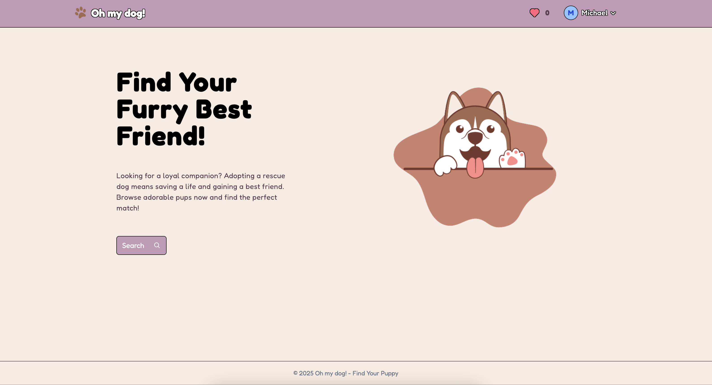
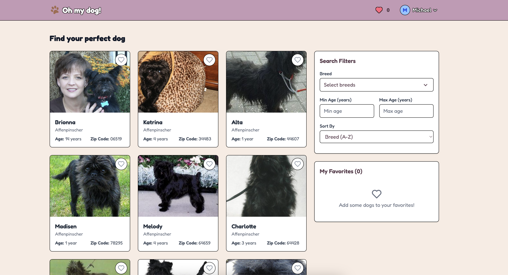

<a id="readme-top"></a>

<!-- PROJECT LOGO -->


<br />
<div align="center">
  <a href="https://github.com/othneildrew/Best-README-Template">
    
  </a>

  <h3 align="center">Oh my dog!</h3>

 #### Project's documentation
</div>


<!-- TABLE OF CONTENTS -->
<details>
  <summary>Table of Contents</summary>
  <ol>
    <li>
      <a href="#about-the-project">About The Project</a>
      <ul>
        <li><a href="#built-with">Built With</a></li>
      </ul>
    </li>
    <li>
      <a href="#getting-started">Getting Started</a>
      <ul>
        <li><a href="#prerequisites">Prerequisites</a></li>
        <li><a href="#installation">Installation</a></li>
      </ul>
    </li>
    <li><a href="#structure">Structure</a></li>
    <li><a href="#api-integration">Api integration</a></li>
    <li><a href="#features">Features</a></li>
    <li><a href="#testing">Testing</a></li>
    <li><a href="#building-for-production">Build for production</a></li>
  </ol>
</details>


<!-- ABOUT THE PROJECT -->
## About The Project



A React application that helps users find and match with dogs for adoption. The application allows the user to search, filter, and mark dogs as favorites to find the perfect match.
Link to deployed website: https://fetch-app-eta.vercel.app/

## Features

- **User Authentication**: Login system using email and name
- **Dog Search**: 
  - Browse available dogs with pagination support
  - Filter dogs by breed
  - Sort results alphabetically by breed (ascending/descending)
  - Includes dog's information, image, name, age, location, and breed
  - Search by zip code
- **Favorites System**: 
  - Add/remove dogs to favorites list
  - Generate matches based on favorited dogs

<p align="right">(<a href="#readme-top">back to top</a>)</p>


### Built With

[](https://skillicons.dev)

<p align="right">(<a href="#readme-top">back to top</a>)</p>


<!-- GETTING STARTED -->
## Getting Started

### Prerequisites


- Node.js
- npm or yarn

### Installation

1. Clone the repository:
```bash
git clone https://github.com/mvykool/Fetch-app.git
cd Fetch-app
cd main
```

2. Install dependencies:
```bash
npm install
```

3. Start the development server:
```bash
npm run dev
```

The application will be available at `http://localhost:5173`

## Available Scripts

- `npm run dev` - Start development server
- `npm run build` - Build for production
- `npm run preview` - Preview production build
- `npm run test` - Run tests
- `npm run test:coverage` - Run tests with coverage report
- `npm run lint` - Run ESLint

<p align="right">(<a href="#readme-top">back to top</a>)</p>


## Structure

```
src/
├── components/    # UI components
├── constants/     # Constants
├── context/       # React Context providers
├── hooks/         # Custom React hooks
├── services/      # API service functions
├── views/         # Page components
├── types/         # TypeScript type definitions
└── Router.tsx     # Application routing
```
<p align="right">(<a href="#readme-top">back to top</a>)</p>

## API Integration

The application integrates with the API (https://frontend-take-home-service.fetch.com) and includes the following main endpoints:

- Authentication: `/auth/login`, `/auth/logout`
- Dogs: `/dogs/search`, `/dogs/breeds`, `/dogs/match`
- Locations: `/locations/search`
<p align="right">(<a href="#readme-top">back to top</a>)</p>

## Features

### Search Functionality
- Users can search for dogs with various filters:
  - Breed selection
  - Age range
  - Location (ZIP code)
- Results are paginated for better performance
- Sorting options available for breed names

### Favorites System
- Users can add dogs to their favorites list
- Favorites are maintained across sessions
- Match generation using favorited dogs
  
<p align="right">(<a href="#readme-top">back to top</a>)</p>

## Testing

The project includes testing using Vitest and React Testing Library. Run tests using:

```bash
npm run test
```

## Building for Production

To create a production build:

```bash
npm run build
```

The build artifacts will be stored in the `dist/` directory.

<p align="right">(<a href="#readme-top">back to top</a>)</p>
